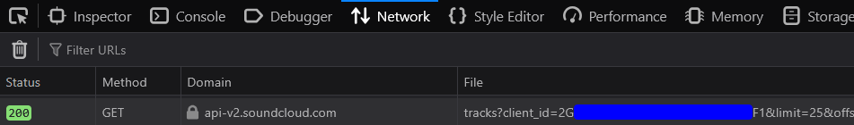

# TraceTracks 🎵

**TraceTracks** is a powerful "OSINT" tool that discovers YouTube videos based on SoundCloud tracks. It automatically searches for YouTube content related to your favorite SoundCloud artists and tracks, helping you find remixes, covers, and any reuploaders related content across platforms.

---

## 🌟 Key Features

- **🔍 Cross-Platform Discovery** - Find YouTube videos related to SoundCloud tracks
- **🎯 Specific Song Search** - Search by title or SoundCloud link
- **📱 Interactive Selection** - Choose tracks with single-key input
- **🔄 All Tracks Mode** - Browse and select from all artist tracks
- **📊 Smart Analytics** - Built-in storage analytics
- **🚫 Duplicate Prevention** - Avoids storing duplicate videos
- **⚡ Real-time Updates** - Tracks view count changes

---

## 🚀 Quick Start

1. **Get your YouTube API key** and save it in the file called: `youtube_api.key` (instructions below)
2. **Get your SoundCloud client ID** from browser developer tools (instructions below)
3. **Run the basic command**:
   ```bash
   python tracetracks.py -u "artist_name" -c "your_client_id"
   ```
4. **Or use interactive mode**:
   ```bash
   python tracetracks.py
   ```
5. **Analyze your results**:
   ```bash
   python analyze_storage.py
   ```

---

## 🛠️ Installation & Setup

### Prerequisites

| Component | Instructions |
|-----------|--------------|
| **🔑 YouTube API Key** | Go to [Google Cloud Console](https://console.cloud.google.com/) → Create project → Enable YouTube Data API v3 → Create API Key → Save as `youtube_api.key` |
| **🎵 SoundCloud Client ID** | Open browser dev tools on SoundCloud → Look for "client_id" parameter in network requests |
| **🐍 Python Dependencies** | `pip install google-api-python-client requests` |

### Installation Steps

#### 1. Clone/download repository

`git clone https://github.com/Oblivios/TraceTracks.git`

#### 2. Install dependencies

`pip install google-api-python-client requests`

#### 3. Put your YouTube API key in `youtube_api.key`

Go to Google Cloud Console (https://console.cloud.google.com/)
Create project
You should be located in: https://console.cloud.google.com/apis/api/youtube.googleapis.com/credentials
Then, enable YouTube Data API v3 and create API Key
Save as `youtube_api.key`

#### 4. Get the SoundCloud client ID

[](img/soundcloud_clientid.png)
Open the browser developer tools (F12 or Ctrl+Shift+I) and go to the Network tab
Go to https://soundcloud.com/ and look for a request that contains `client_id` as shown in the image

#### 5. Ready to go!
`python tracetracks.py`

---

## 💻 Usage Guide

### 🎮 Interactive Mode
```bash
# Simple interactive mode (prompts for username)
python tracetracks.py
```

### 🖥️ Command Line Options

#### Basic Usage
```bash
# With username
python tracetracks.py --username "artist_name"
python tracetracks.py -u "https://soundcloud.com/artist_name"

# With client ID
python tracetracks.py --username "artist_name" --client-id "your_client_id"
python tracetracks.py -u "artist_name" -c "your_client_id"
```

#### Advanced Search
```bash
# Search specific song by title
python tracetracks.py --username "artist_name" --song "track_title"
python tracetracks.py -u "artist_name" -s "track_title"

# Search by SoundCloud link
python tracetracks.py --username "artist_name" --song "https://soundcloud.com/artist/track-name"
python tracetracks.py -u "artist_name" -s "https://soundcloud.com/artist/track-name"

# Browse all tracks interactively
python tracetracks.py --username "artist_name" --all
python tracetracks.py -u "artist_name" -a

# With sorting and limits
python tracetracks.py --username "artist_name" --sort-by recent --num-tracks 5
python tracetracks.py -u "artist_name" -sb oldest -n 10
python tracetracks.py --username "artist_name" --sort-by popular --num-tracks 3
```

### 📋 Parameters Reference

| Parameter | Short | Description | Options | Default |
|-----------|--------|-------------|---------|---------|
| `--username` | `-u` | SoundCloud username or profile URL | Any valid username/URL | Prompt for input |
| `--client-id` | `-c` | SoundCloud client ID | Any valid client ID | Prompt for input |
| `--song` | `-s` | Search for a specific song by title or link | Song title or SoundCloud URL | Process multiple tracks |
| `--all` | `-a` | List all tracks and ask for each one individually | N/A (flag) | Disabled |
| `--sort-by` | `-sb` | Sort tracks by | `recent`, `oldest`, `popular` | `recent` |
| `--num-tracks` | `-n` | Number of tracks to process | Any positive integer | `1` |

### 🎯 Interactive Features

**🔍 Song Search Modes:**

**By Song Title** (case-insensitive partial matching):
```bash
python tracetracks.py -u "artist_name" -s "track_title"
```

**By SoundCloud Link** (exact track matching):
```bash
python tracetracks.py -u "artist_name" -s "https://soundcloud.com/artist/track-name"
```

**🎵 All Tracks Mode** - Browse through all tracks:
```bash
python tracetracks.py -u "artist_name" -a
```

**⌨️ Single-Key Input** - Press just `y` or `n` without Enter (works on all platforms!)

When using `--song` or `--all`, you'll see:
```
1. Track Title by Artist
   Plays: 15,234
   Link: soundcloud.com/artist/track-name
Search for YouTube videos of this track? (y/n): [y]
✓ Added to processing list
```

---

## 📊 Analytics Dashboard

Analyze your collected data with the built-in analytics tool:

```bash
python analyze_storage.py
```

**📈 What You Get:**
- **Overall Statistics** - Total videos, views, and unique channels
- **Top Channels** - Ranked by video count and total views  
- **View Distribution** - Breakdown by view ranges
- **Detailed Channel Stats** - Videos and average views per channel

**Sample Output:**
```
============================================================
STORAGE ANALYTICS - OVERALL STATISTICS
============================================================
Total Videos: 90
Total Views: 222,447
Total Different Channels: 35

============================================================
TOP CHANNELS BY VIDEO COUNT
============================================================
 1. ArtistChannel
    Videos: 29 | Total Views: 51,396 | Avg Views: 1,772.3

============================================================
VIEW DISTRIBUTION
============================================================
Highest Views: 2,345,678

View Ranges:
  0-100 views: 3 videos (3.2%)
  101-1K views: 34 videos (36.2%)
  1K-10K views: 46 videos (48.9%)
  10K-100K views: 10 videos (10.6%)
  100K+ views: 1 videos (1.1%)
```

---

## 📁 Output & Storage

TraceTracks creates a `storage/` directory with organized data:

| File | Content |
|------|---------|
| **`links.txt`** | Simple list of YouTube video URLs |
| **`links_info.txt`** | Detailed info: title, views, channel, link |

**🔍 Real-time Video Information:**
```
Found 5 videos for 'Track Title Artist':
  Title: Track Title - Official Music Video
  Views: 1,234,567
  Channel: ArtistChannel
  Link: https://www.youtube.com/watch?v=example

  Title: Track Title (Remix)
  Views: 987,654
  Channel: RemixChannel
  Link: https://www.youtube.com/watch?v=example2
```

---

## 🎯 Example Workflow

```bash
TraceTracks - Find YouTube videos based on SoundCloud tracks
Artist ID from username: 123456789
Loaded 15 existing videos from storage

Found 17 tracks. Listing all tracks (most recent first):

1. Track Title by Artist Name
   Plays: 15,234
   Link: soundcloud.com/artist/track-name
Search for YouTube videos of this track? (y/n): [y]
✓ Added to processing list

2. Another Track by Artist Name
   Plays: 8,567
   Link: soundcloud.com/artist/another-track
Search for YouTube videos of this track? (y/n): [n]
✗ Skipped

Processing 1 selected track(s)
Found 8 videos for 'Track Title Artist Name':
  Title: Track Title - Official Music Video
  Views: 1,234,567
  Channel: ArtistChannel
  Link: https://www.youtube.com/watch?v=example

Updated views for: Track Title Remix (987,654 views)
Added new video: Track Title Live Performance (456,789 views)
Saved 18 videos to storage
```

---

## ⚙️ How It Works

**🔍 Process Flow:**
1. **SoundCloud Analysis** → Fetches track information using SoundCloud API
2. **Smart Title Processing** → Cleans titles by removing bootleg/remix tags
3. **YouTube Search** → Searches for videos matching track title and artist
4. **Content Filtering** → Ensures relevance by checking video descriptions
5. **Data Storage** → Saves results and tracks view count changes
6. **Duplicate Management** → Updates existing entries with new view counts

---

## 🛠️ Technical Stack

| Component | Technology |
|-----------|------------|
| **Language** | Python 3.x |
| **APIs** | YouTube Data API v3, SoundCloud API v2 |
| **Libraries** | `google-api-python-client`, `requests`, `argparse`, `re` |
| **Input** | `termios` & `tty` (Linux/macOS), `msvcrt` (Windows) |
| **Platform** | Linux, macOS, Windows |

---

## ⚠️ Important Notes

| ⚠️ Limitation | 📝 Details |
|---------------|------------|
| **API Quotas** | YouTube API: 10,000 requests/day (free tier) |
| **Client ID** | Must provide your own SoundCloud client ID |
| **Platform** | Cross-platform single-key input works on Windows, Linux, and macOS |
| **Updates** | May need updates if SoundCloud modifies API |

--- 

## 🐛 Bug Reporting

If you encounter any issues or bugs while using TraceTracks, please report them on the [GitHub Issues page](https://github.com/Oblivios/TraceTracks/issues).

---

## 📜 License

This project is licensed under the MIT License - see the [LICENSE](LICENSE) file for details.

---

## 🔗 Useful Resources

- 📖 [YouTube Data API Documentation](https://developers.google.com/youtube/v3)
- 🎵 [SoundCloud API Documentation](https://developers.soundcloud.com/)